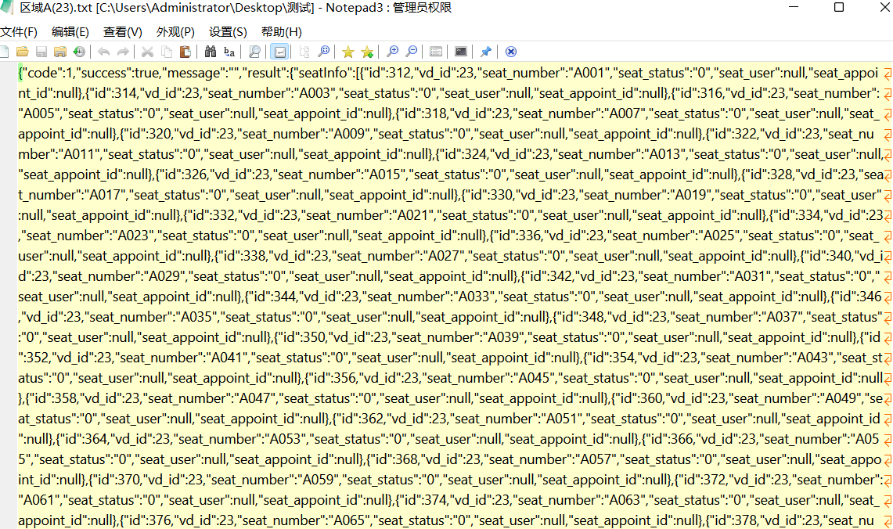
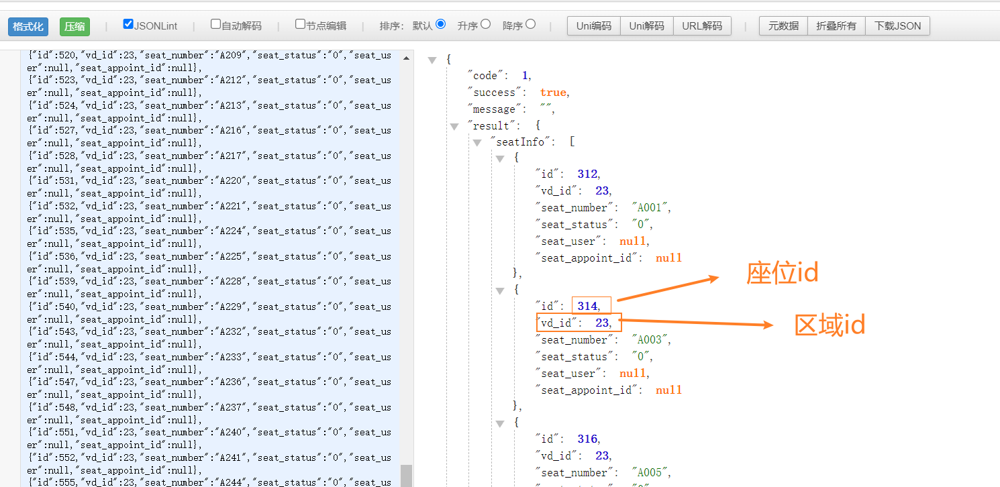
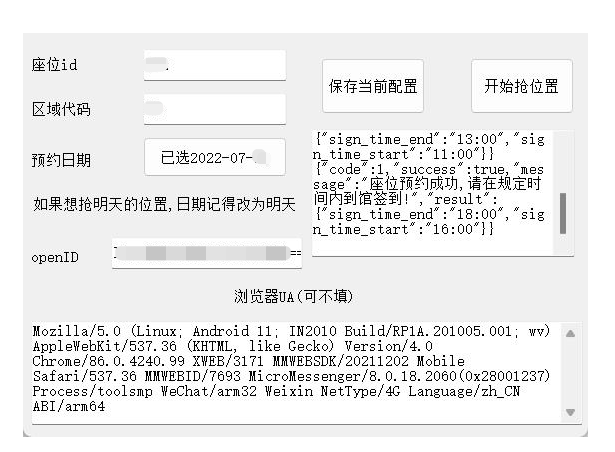
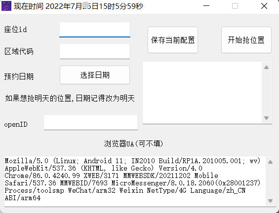
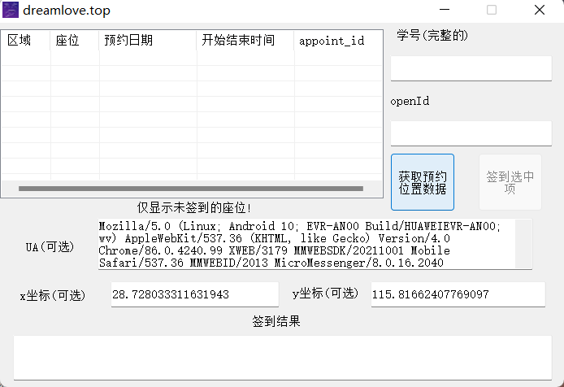
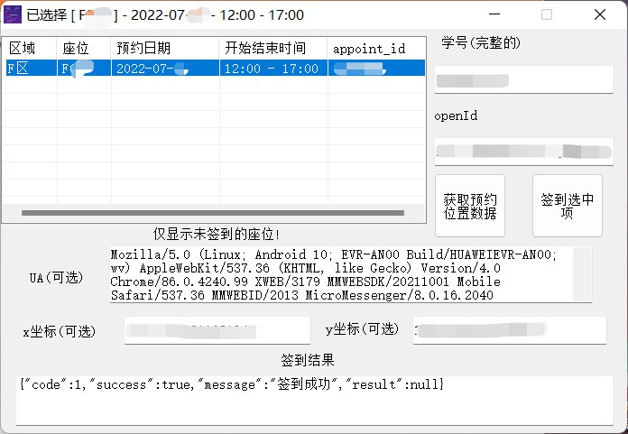
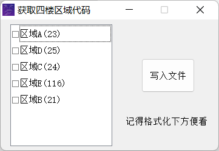

### 注意

* openid需要自己抓包,这个没有办法~
* 还有,**抢位置目前只做了4楼,3楼没必要~**
* 签到位置4楼,3楼都可以
* 区域代码的话使用下面的获取区域代码工具就可以
* **你怕有毒就别用,我没心思做什么病毒**

#### 下载地址

* github:https://github.com/superBiuBiuMan/positionForwechat
* gitee(如果访问不了请去github):

### 使用

#### 1.获取openid

* 这个需要抓包,或者要会的人帮你抓包下

#### 2.通过下面工具找到对应的座位id和区域id

* 工具有获取区域的,自己找下并格式化下就可以

#### 3.然后填入对应的位置就可以

* 就可以使用啦

### 截图

#### 抢位置(4楼)

#### 签到位置(4楼,3楼都可以)

#### 区域代码获取(4楼位置)

* 获取的一般是这种,自己格式化下就好

